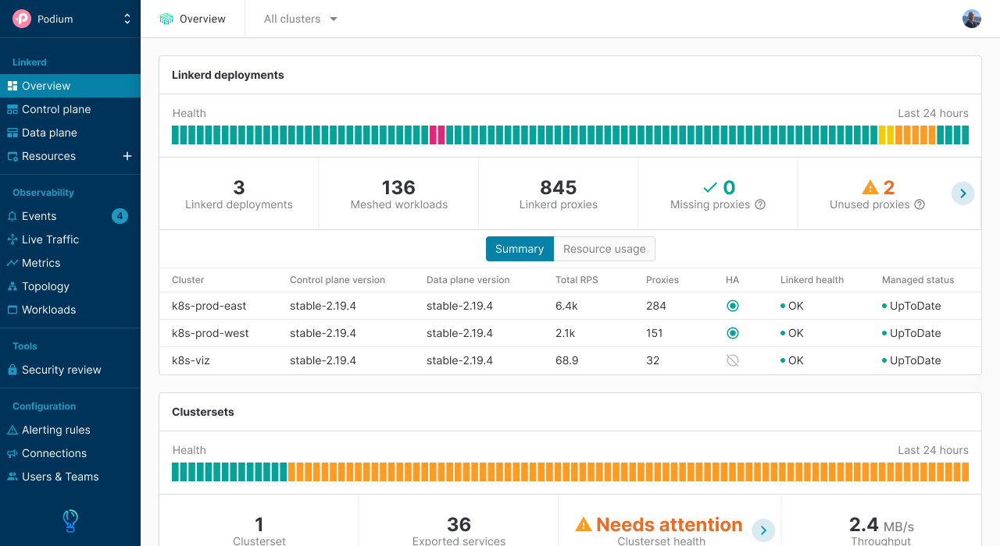
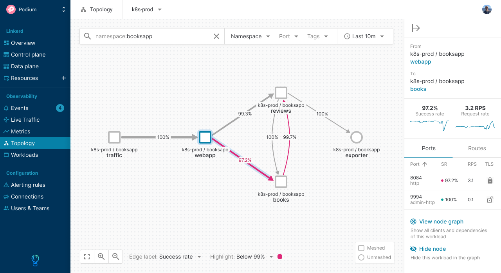
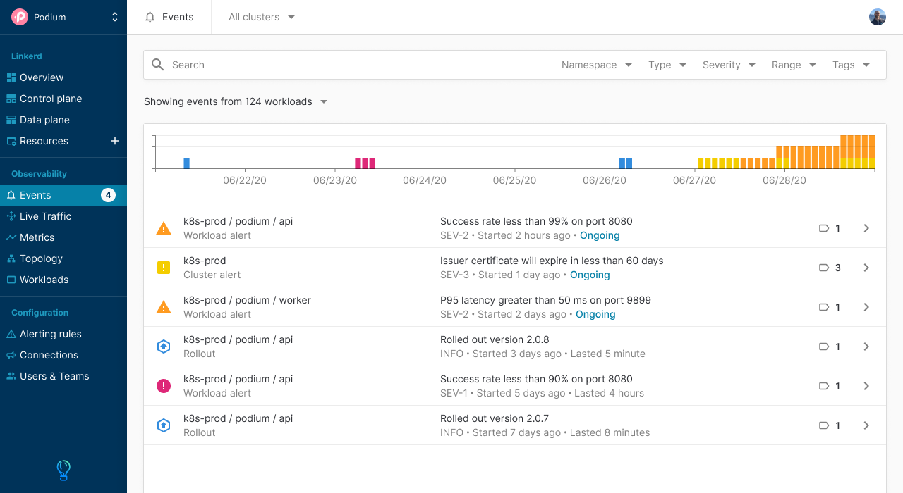
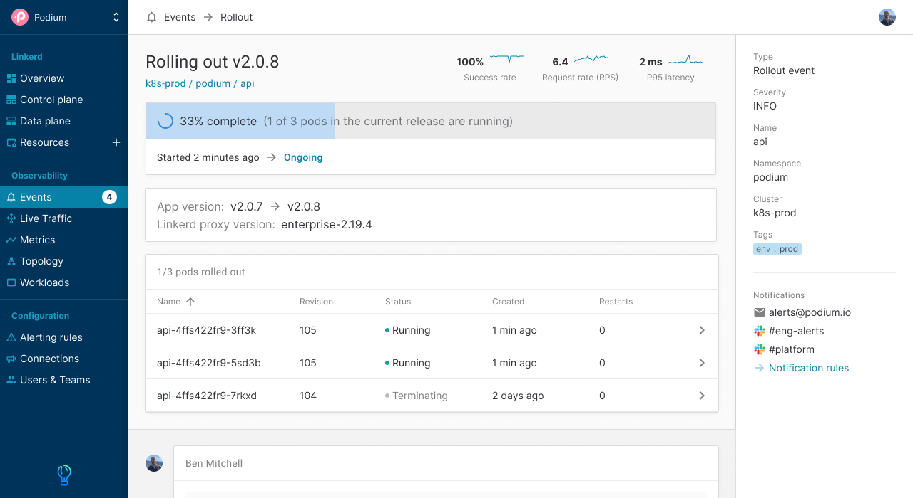
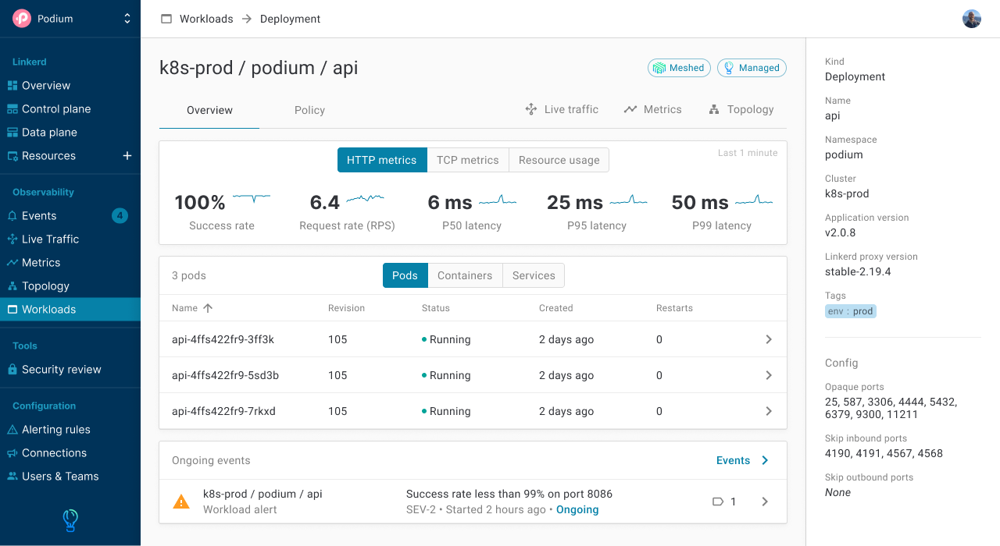


Since 2019, I have led the end-to-end UX, UI, and system design for Buoyant Cloud, a multi-cluster observability, monitoring, and alerting platform built for Buoyant Enterprise for Linkerd (BEL).

Tasked with turning complex Kubernetes data into an intuitive enterprise platform, I designed an interface that allows infrastructure teams to quickly identify critical issues in their clusters. The core design challenge centered around data density and cognitive load: parsing a massive amount of "golden metrics" into clear, actionable insights.

One of the highlights of the platform is an interactive and filterable network topology graph, built dynamically from live traffic data. This enables engineers to quickly identify network requests that are failing and correlate metrics from clients and dependencies.

Some other highlights include:

- **Cluster health monitoring:** Aggregated views that provide insight into Linkerd's control plane and data plane status, trust anchor rotation, and health metrics.
- **Event timeline:** Proactive event timelines correlating metrics, deployment rollouts, and authorization policy statuses.
- **Configurable alerts:** Streamlined configuration that help teams wire up Slack, DataDog, and PagerDuty alerting in minutes.










