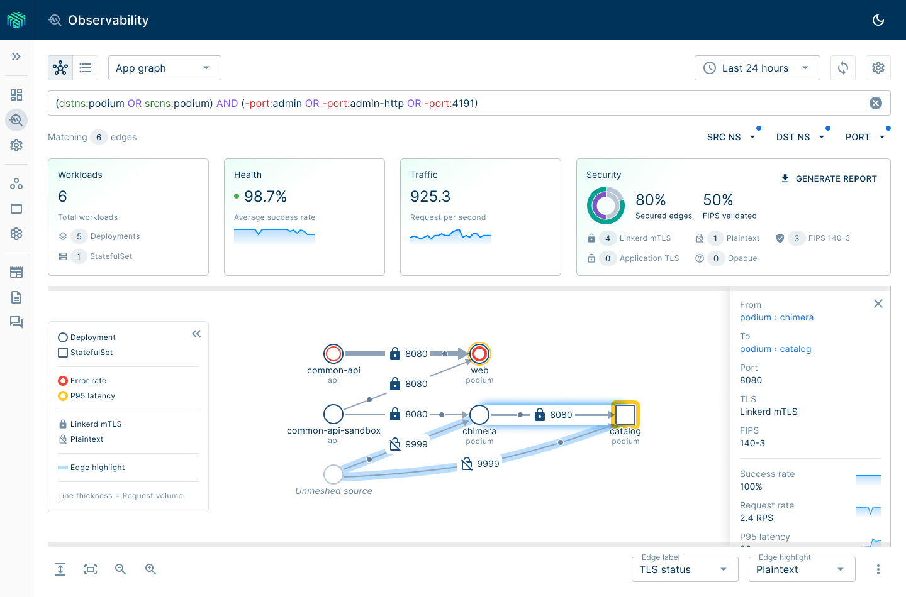

Over the past several years I've been working on Buoyant Cloud, a SaaS observability tool for Linkerd. More recently, I've shifted focus to bring everything I've learned from Buoyant Cloud into the Kubernetes cluster through an on-premises Linkerd dashboard.

Stay tuned for more details!

