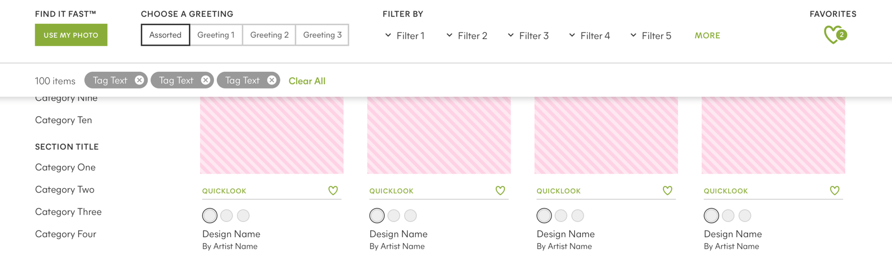


As [Minted Wedding Websites](./minted-wedding-websites/) moved from the legacy Hitched Up app to React, it gave me the opportunity to create a responsive component library from the ground up. This library allowed our team to build consistently, launch new features at a faster pace, and reduce internal miscommunication. After demonstrating the effectiveness of this structure and process, I was given the opportunity to architect a design system for the entire online experience at Minted.

The building blocks of this system are broken down into six categories:



## Guidelines

Guidelines contains the rules for file structure, symbol organization, and naming conventions.



## Foundation

Foundation contains the abstract properties such as font definitions, colors, grid structure, and spacing.



## Elements

Elements contain all the individual pieces of the interface, such as icons, buttons, tabs, and form controls. Most elements are built so that the width is controlled by the parent container, and they can not contain any external spacing.



## Components

Components are groups of Elements that form distinct sections of the interface, such as the main navigation, modal window, or a sortable content list. They can respond to page breakpoints, and can specify external spacing.



## Templates

Templates consist mostly of Components, but occasionally Elements. They represent the layout and functionality of a specific page type.



## Pages

Pages are instances of Templates, with placeholder content replaced with real content. They are the closest representation of what the user will see, and provide a way to test the integrity of the building blocks.



I've learned so much throughout the process of designing this system, probably the most important is that it's vital to have a clear process and set of tools for iterating and communicating the evolution of the system to both UX and Engineering.

Other insights I've learned include: understanding how different unit scales affect composability, how to effectively manage component spacing, and how to manage complex organization for symbols, layers, and naming conventions to allow for expansion.

Even though maintaining a component library can be a challenge across multiple projects and teams, it's one of my favorite responsibilities at Minted because it provides me with a continuous source of personal growth, and allows me to work cross-functionally with many teams across the company.

[Check out the next project](./minted-wedding-websites/) to see it in use.

