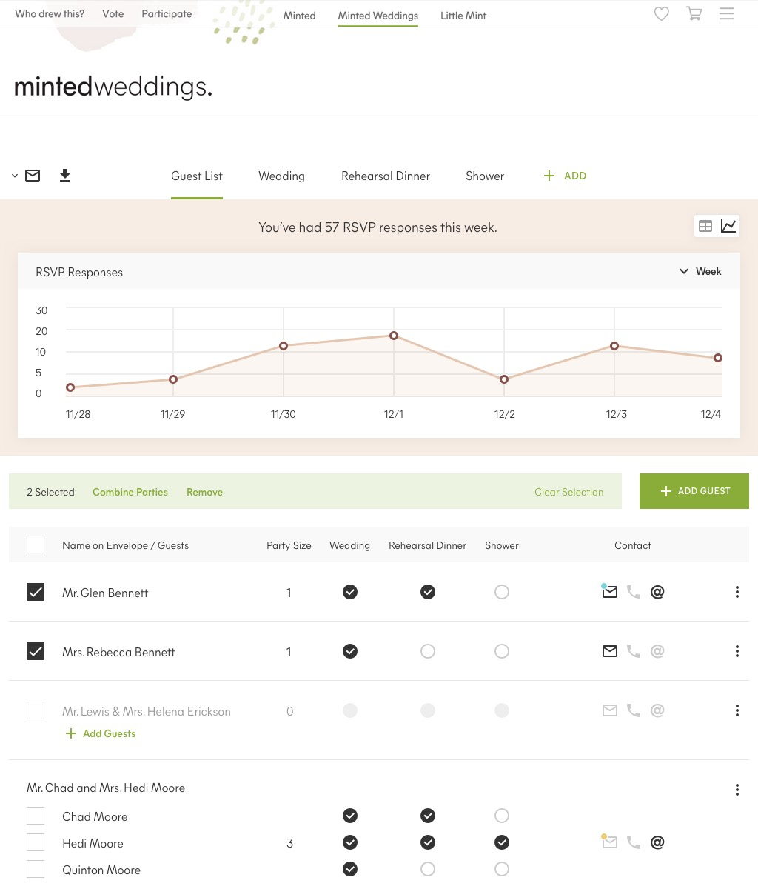
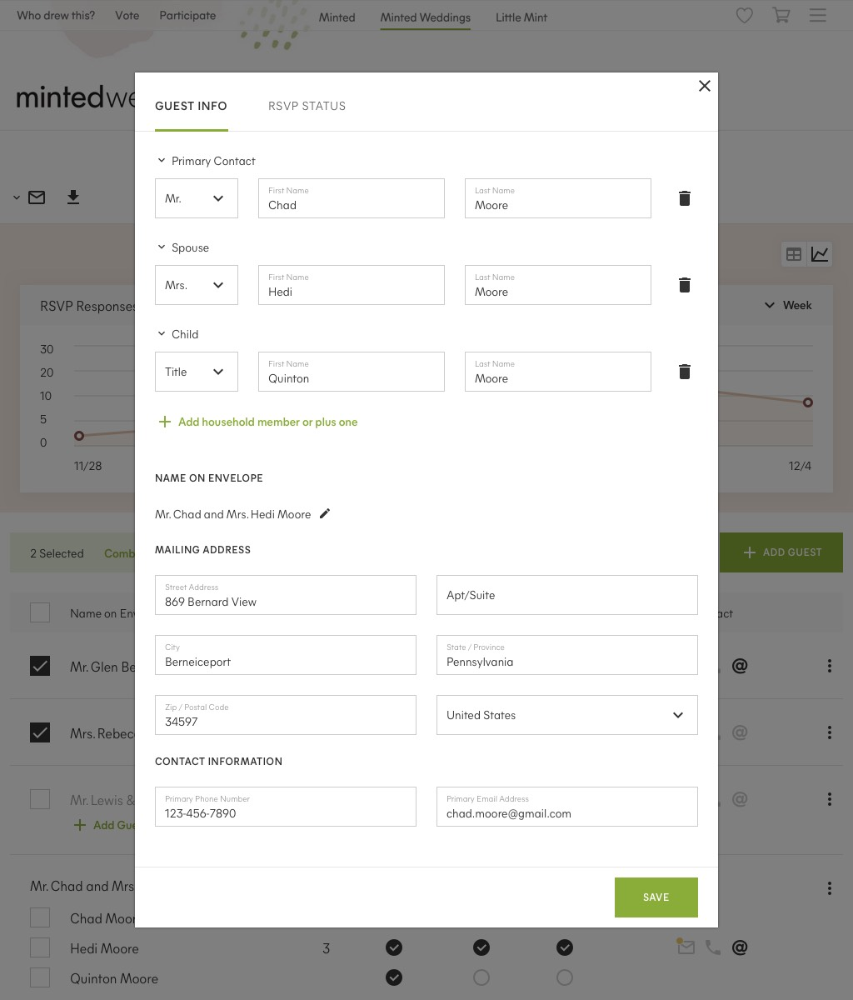
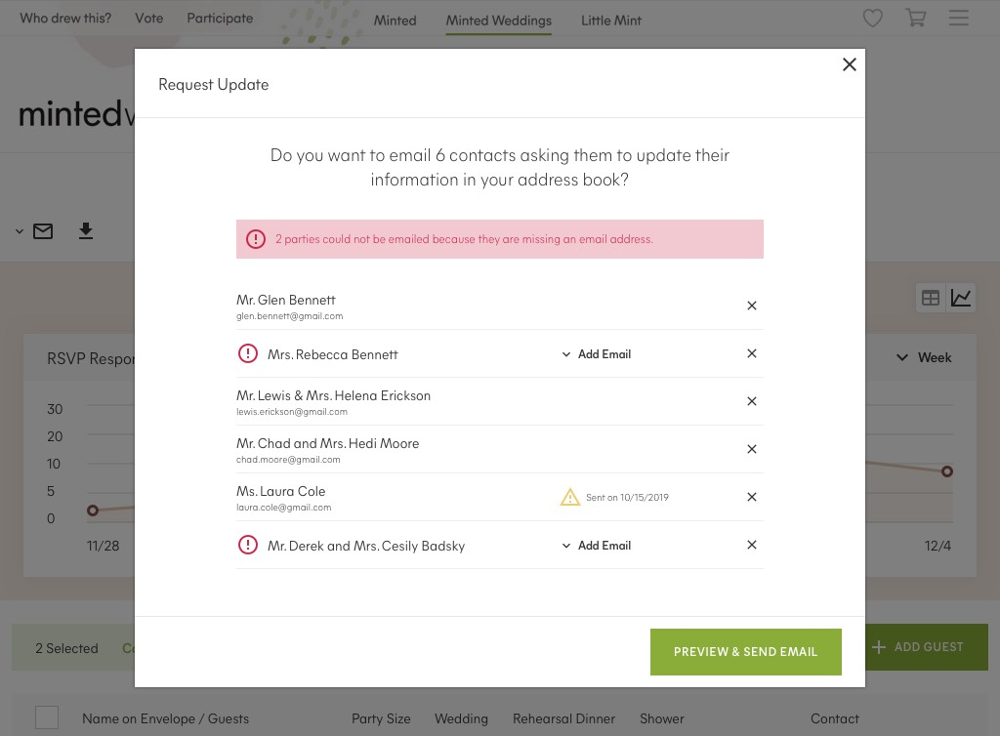
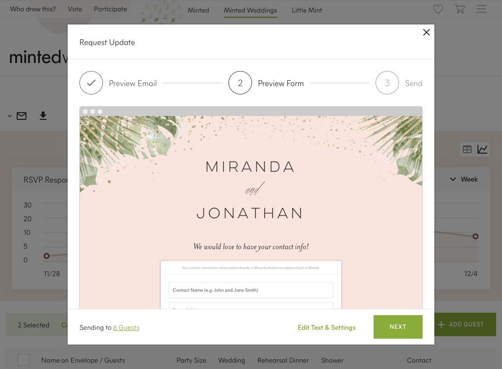
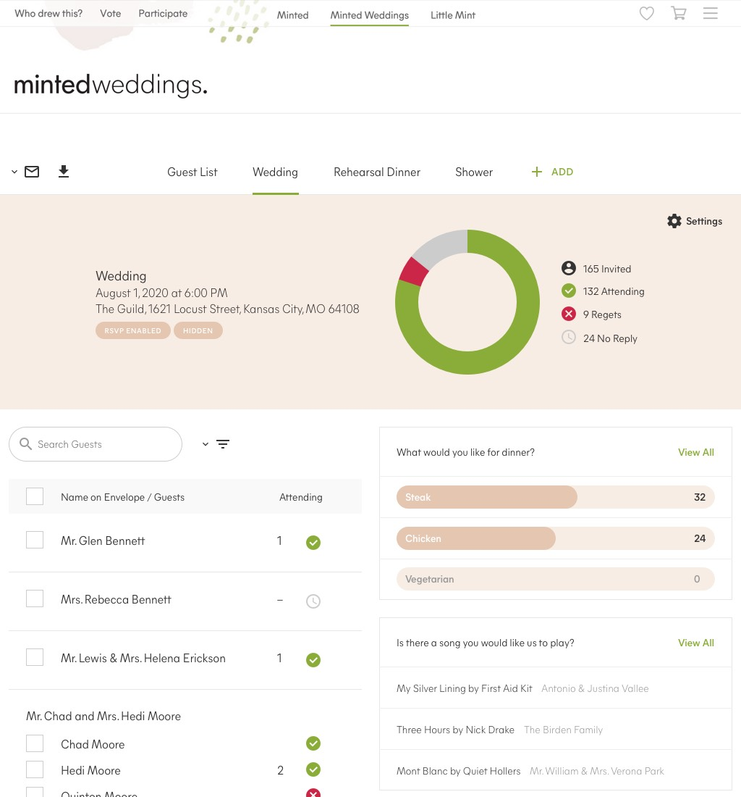
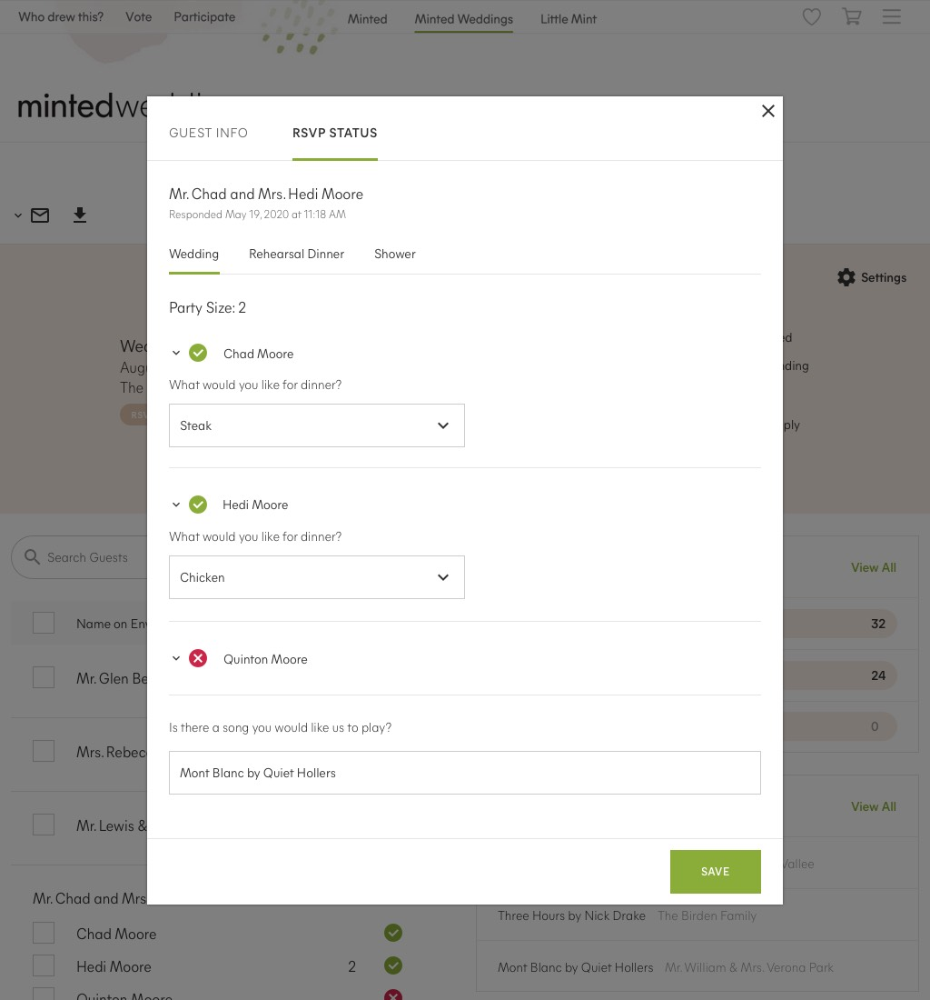
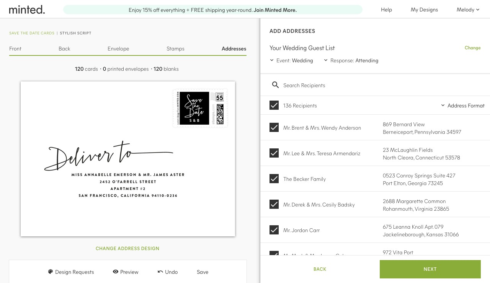






Guest List management, guest communication, & guest details



Through user research, it became clear that Minted could engage the wedding customer earlier in their wedding journey if Guest List Management was separated from [Minted Wedding Websites](./minted-wedding-websites/). It would allow the customer to begin their wedding planning without the requirement of photos and content. It would also enable Minted to deliver on the promise of fully-integrated products: build the guest list once, and access it in any wedding product or service.







Integrated Address Collection with thousands of themes available







Event management & RSVP details with data visualization



Deep integration throughout Minted's platform



Guest List Management at Minted is poised to be best in class due to a set of features that can not be found in any other service, combined with the simplicity of deep integration throughout Minted's platform. Utilizing focus groups and a keen eye on competitors, Minted found a unique opportunity to provide value in an increasingly competitive landscape.

