
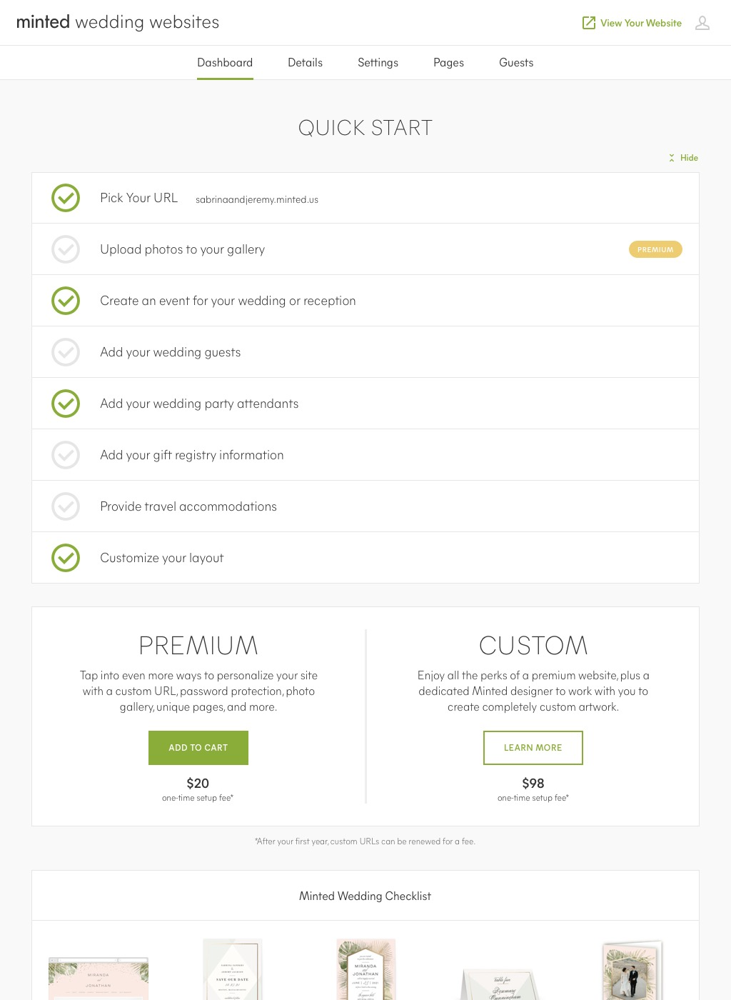

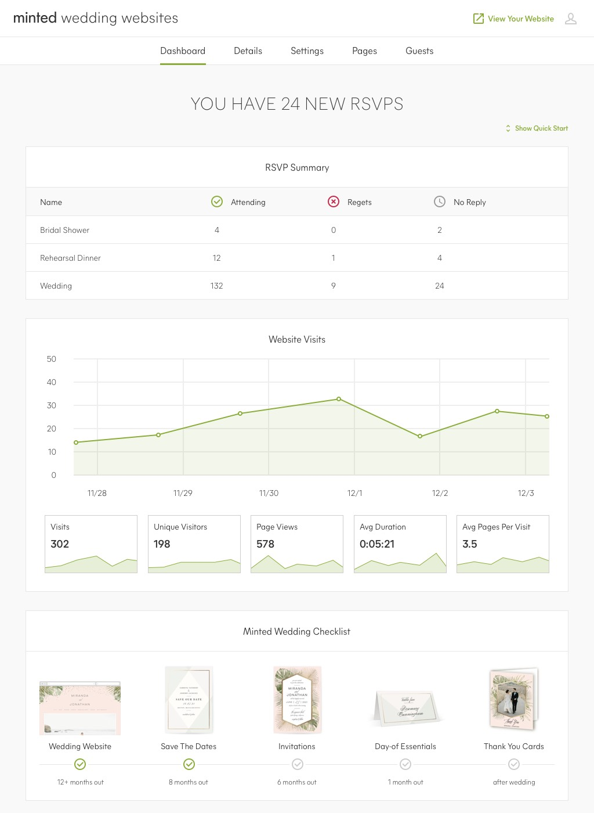



Product onboarding & wedding lifecycle touchpoints



In 2013, I co-founded Hitched Up, a service aiming to be the easiest, fastest way to build your wedding RSVP site. Hitched Up was acquired by Minted in 2015.

Minted Wedding Websites is a web-based product that has evolved to provide event management, guest list management, guest communication, and RSVP tracking. It also includes tools to create a customizable website for the wedding guests to manage content for gift registries, accommodations, directions, photos, wedding party, and information about the couple.



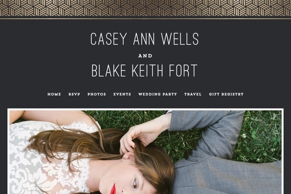

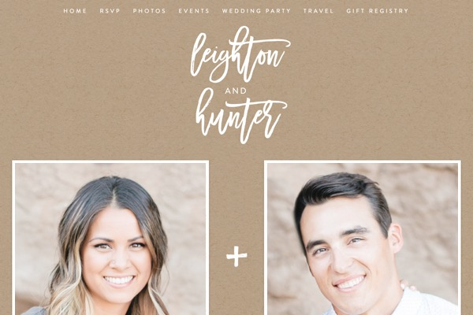

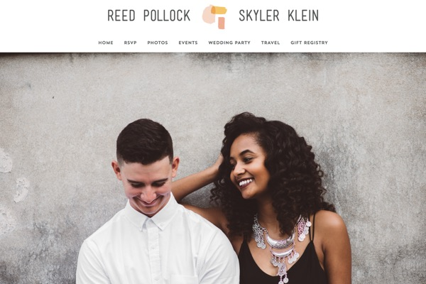

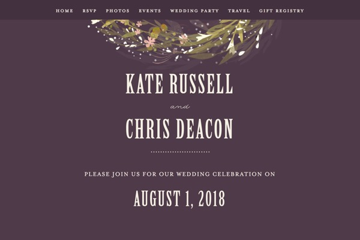



Just a few of the thousands of wedding website designs built using Minted ThemeBuilder



### My Role

- Co-Managed product strategy and led roadmap planning
- Became the voice of the customer through user research
- Delivered visual user flows, wireframes, prototypes, interaction design, and visual design

### Top User Goals

- Provide a fun and intuitive experience that customers love to use
- Hide complexity in simplicity
- Create the easiest and most powerful guest management and RSVP platform

### Top Business Goals

- Conversion of traffic to active users
- Conversion of users to stationery purchases
- Conversion of users to premium tier


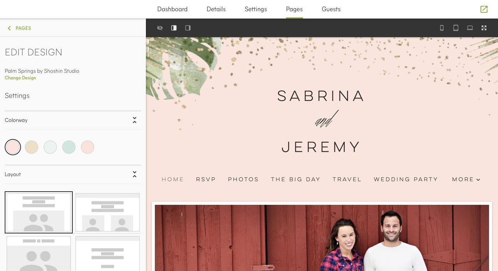


Customize the colorway, layout, fonts, and more



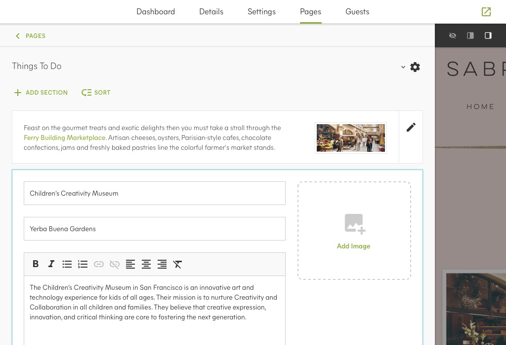

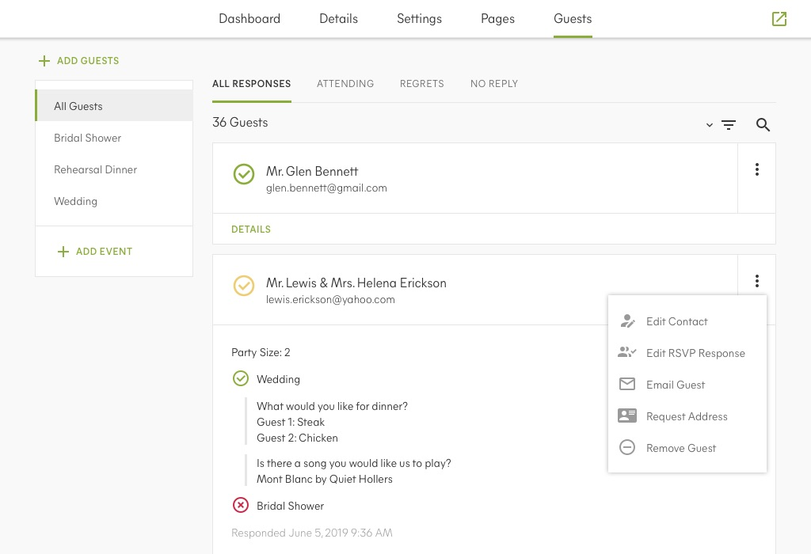



Manage content, guest list, & RSVPs



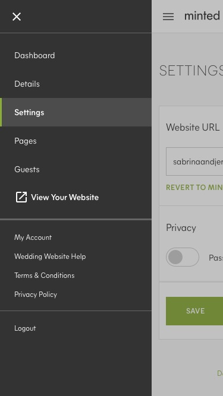

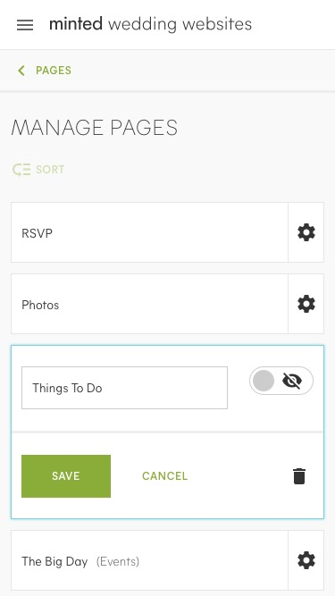

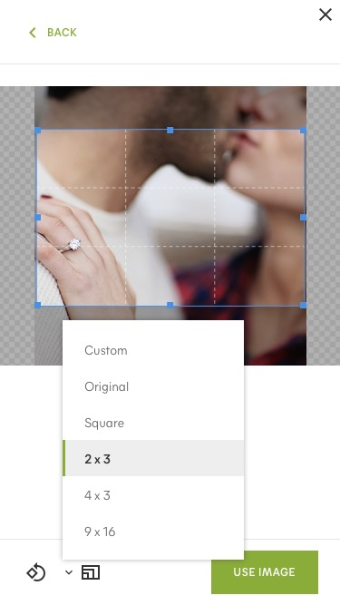



All functionality available from any device



Minted Wedding Websites has been an overwhelming success for Minted and has achieved its goals year after year. It has successfully engaged Minted's customers earlier in the wedding lifecycle, provided intuitive tools to help manage wedding details, and increased conversion of new customers to stationery products.

