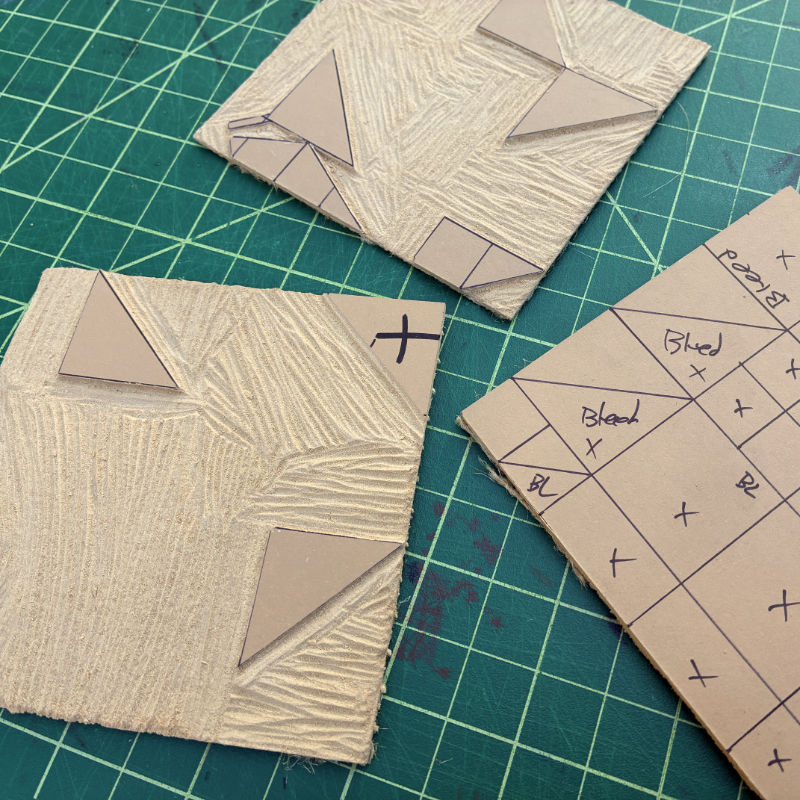
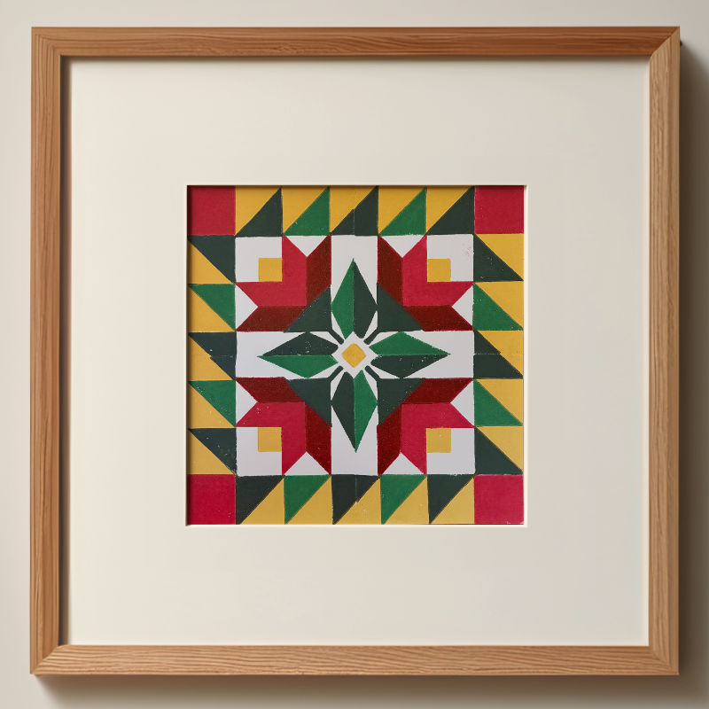

My 2nd linocut barn quilt. Unfortunately, this one turned out a bit sloppier than I wanted. However, I added a little bleed between the colors and printed from light to dark which helped hide a lot of the issues. My guess is that I over inked the block, and applied too much pressure on the press. I also won't be using that linoleum brand again either, it was very hard to keep the acute corners from breaking off. Hopefully the next one will be a little better.




